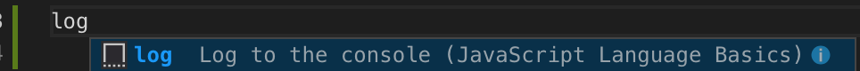

## 快捷键

- option 对单词操作
- cmd 对行操作
- shift 大部分用于选择
- Backspace 是 MacOS 上就是“fn + delete”的组合

### 光标

字符、单词、行、代码块、整个文档, 很多时候单词、行是基于单键操作的加上一些固定的按键完成。 譬如option 往往用作单词、cmd 往往用作行， 所以 option + left 就是单词开头； cmd + left 就是 行首， 当然也有一些特别的， 具体看下面：

- 单键操作
  - 字符
    - left 上一个字符
    - right 下一个字符
  - 行
    - up 上一行
    - down 下一行

- 组合键操作
  - 单词
    - option + left 单词开头
    - option + right 单词结尾

  - 行
    - Cmd + 左方向键 行首
    - Cmd + 右方向键 行尾
    
  - 代码块
    - Cmd + Shift + \ 花括号{}、[]、()之间跳转

  - 整个文档
    - Cmd + up 页首
    - Cmd + down 页尾

  - 多行（多光标）
    - 按住 option 单击鼠标
    - Cmd + D 选中当前光标的单词；再按选择同时选择下一个
    - Option + Shift + i 在选择内容的每一行末尾添加一个光标
  
### 文本选择

对于基于单词、行和整个文档的光标操作，你只需要多按一个 Shift 键，就可以在移动光标的同时选中其中的文本。
- 单字符
  - shift + left 选择当前光标向左的字符
  - shift + option + right 选择当前光标向右的字符
  - 
- 单词
  - shift + option + left 选择当前到单词开头
  - shift + option + right 选择当前到单词结尾

- 行
  - shift + Cmd + 左方向键 选择当前到行首
  - shift + Cmd + 右方向键 选择当前到行尾

- 代码块(暂时没有)

- 整个文档
  - shift + Cmd + up 选择当前到页首
  - shift + Cmd + down 选择当前到页尾
  - Cmd + a 选择整个文档

### 文本删除

文本选中后按 delete 按键是其中一个方法删除文本，但删除文本单次操作就可以完成任务 

- 单键操作
- 单字符
  - delete : 用于删除当前光标左边
  - Backspace (fn + delete) : 用于删除当前光标右边

- 单词
  - Option + Delete 把当前单词里光标前的字符删除
  - Option + Backspace 把当前单词里光标后的字符删除

- 行
  - Cmd + Backspace 删除当前行光标后所有文本
  - Cmd + Delete 删除当前行光标前的所有文本
  - Cmd + Shift + K ，删除当前代码行 
- 代码块(暂时没有)

- 整个文档
  - shift + Cmd + up 选择当前到页首
  - shift + Cmd + down 选择当前到页尾

### 进阶操作

- 正常编辑
  - Cmd + Enter 当前行的下面新开始一行
  - Cmd + Shift + Enter 当前行的上面新开始一行
  - Option + 上下方向键 将当前行，或者当前选中的几行代码，在编辑器里上下移动。
  - Option + Shift + 上下方向键 复制当前行，或者当前选中的几行代码，然后粘贴到当前行的上面或者下面
  - Cmd + x ，剪切某一行代码
  - Cmd + v ，粘贴
  - f2, 选择函数定义按f2, 自动替换文中所有使用改函数的名字

- 编程语言相关的命令
  - Cmd + / 将一行代码注释掉
  - Option + Shift + A 把一整段代码注释掉
  - Option + Shift + F 来对整个文档进行格式化
  - Cmd + K Cmd + F 这样只有这段被选中的代码才会被格式化。

- 其他， Cmd + Shift + P 调用命令面板选择
  - 缩进
  - 转大小写
  - 。。。

### 自定义快捷键
- 待完善

## 鼠标

一点、二拖、三松手

单击鼠标左键就可以把光标移动到相应的位置。而双击鼠标左键，则会将当前光标下的单词选中。连续三次按下鼠标左键，则会选中当前这一行代码。最后是连续四次按下鼠标左键，则会选中整个文档。

通过鼠标左键移动代码位置

鼠标左键拖拽 +Option 键，复制粘贴代码块

利用鼠标中键添加多光标

悬停提示窗口 了解函数的类型信息

按下 Cmd 键，辅助以鼠标，查看函数实现

通过 Cmd 键和鼠标左键，跳转到函数定义处

通过 Cmd 键和鼠标左键，打开超级链接

## 代码片段（code snippet）

首先体验一下：
输入 `log` 即可看到 Print to console 代码片段
然后再按下回车或者 Tab 键，就能够将这个代码片段插入编辑器了。

