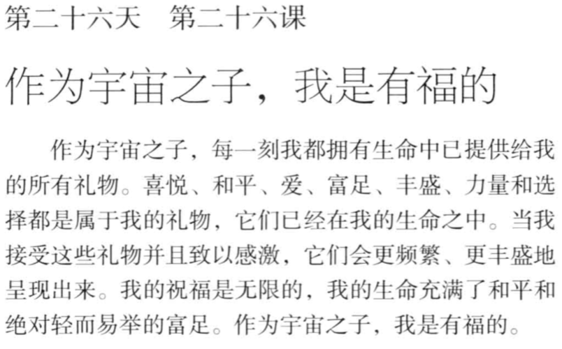
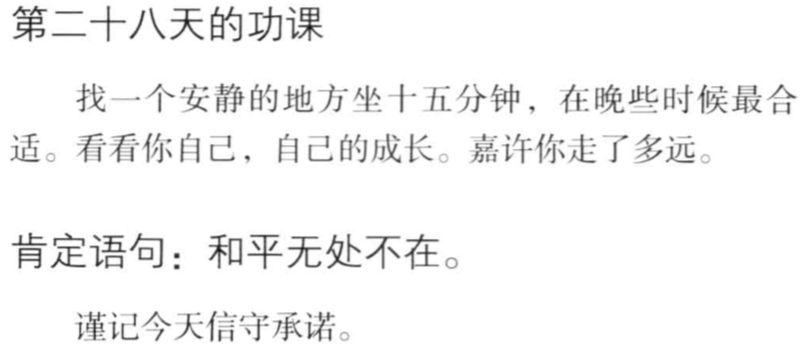
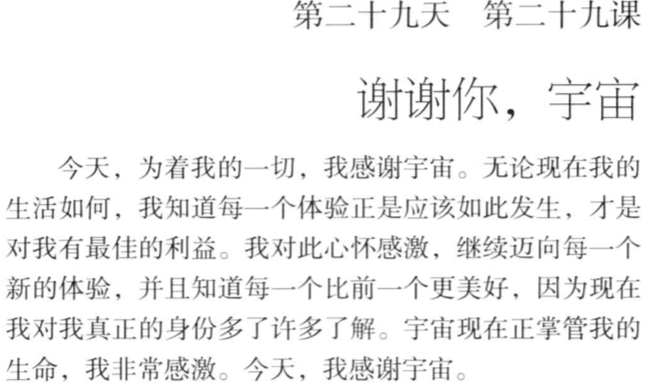

#

## 前言

## 第01天

+ 小我：孔子“小人比而不周；君子周而不比”，小我，就是“比”，我们比他人好，我们独特； 我们不如他人好，我们内疚；小我只会看到别人的小我！

+ 灵性：书中提到了灵性，我想就是君子周而不比的周，人可以看到宇宙，关系，灵性就是区别，我们可以看到周

## 第02天

## 第03天

## 第04天

## 第05天

## 第06天

## 第07天

## 第08天

## 第09天

## 第10天

## 第11天

## 第12天

## 第13天

## 第14天

## 第15天

## 第16天 我在作出反应前暂停片刻

手里拿着锤子， 看到什么都是钉子！

第一反应做出来的动作， 往往是自己固有的认知！

情绪也是认知！

暂停片刻, 想一想，还有没有其他工具可以解决这个问题！ 除了锤子， 也许自己还有锯子！

## 第17天

## 第18天

## 第19天

## 第20天

## 第21天

## 第22天

## 第23天

## 第24天

## 第25天

## 第26天

## 第27天
   

## 第28天

## 第29天

## 第30天

谢谢你，宇宙